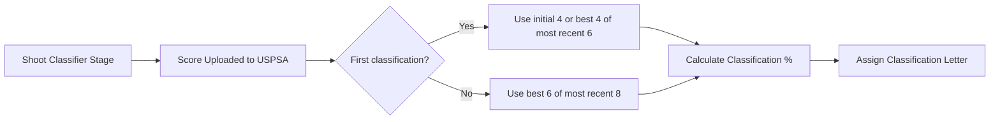
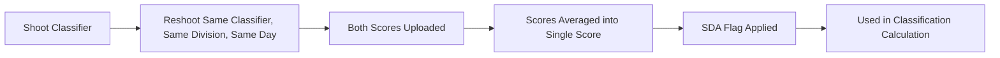
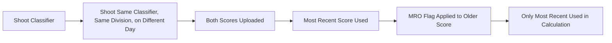

# USPSA Classification System

## What Is It?
The USPSA classification system dates back to 1985 when then-President Dave Stanford proposed a system of classifying competitors from a common database. Members shoot USPSA Classifier Stages at matches, and the scores are submitted to USPSA and added to member profiles.

The classification system provides USPSA members with a standardized framework to measure, test, and compare their shooting skills to a national standard at Level I matches. With over 39,000 current members and thousands of scores per division per classifier stage, this system enables substantial statistical analysis of shooting performance and skill ranking.

## High Hit Factors
Members are awarded a class based on a series of percentages calculated for them. Each percentage is the score (Hit Factor) they shoot on a specific stage divided by the High Hit Factor used for that stage. The High Hit Factors are calculated using a standardized algorithmic method that applies a Weibull statistical distribution with Percentile Targeting, where the 97th percentile of all scores is set to represent 90% of the High Hit Factor.

### Classification Bracket Percentages
| Classification | Percentage of High Hit Factor |
|----------------|----------------------------------|
| Grand Master   | 95 to 110%                      |
| Master         | 85 to 94.9%                     |
| A              | 75 to 84.9%                     |
| B              | 60 to 74.9%                     |
| C              | 40 to 59.9%                     |
| D              | 2 to 40%                        |

## Earning A Classification
To become classified, a member must have at least four valid scores from different classifier courses in the USPSA database. If more than four scores are in the database when the averages are calculated, the best six of the most recent eight valid scores will be used. Any scores in excess of the most recent eight valid scores are not used for the initial classification.

All scores from different classifier courses (except DNFs and no-shot scores) will be used to determine a classification. Individual scores will be assigned flags indicating their status in the classification calculation.

Most of the scores will come from classifier courses set up by USPSA-sanctioned matches. The clubs are responsible for setting up these stages according to exact specifications and for administering them uniformly. They are part of the club's monthly match, are included in the calculation of the match results, and are submitted for national classification of the member.

Each Tuesday night, the classification program evaluates all new scores that have been uploaded and paid for since the previous week's run. Note that there may be times when the system is run a day or so early or perhaps not run during a national championship week.

A member's classification in a division cannot be more than one class lower than their highest classification in any other division. This means that if a member's highest classification is A in the Open division, and they obtain a C classification in the Limited division, their Limited division classification will be adjusted to B. Reclassification in one division may result in a corresponding adjustment in the member's classification in other divisions to ensure compliance with this policy.

## Classifier Reshoots
At the discretion and convenience of match officials, competitors may be permitted to reshoot a classifier stage for classification purposes only.

### Restrictions on Classifier Reshoots
- Competitors are limited to one reshoot per classifier stage, per division, per match
- Additional reshoots beyond the first reshoot are prohibited

### Scoring and Recording of Classifier Reshoots
- The competitor's first score on the classifier stage must be used for match standings and awards
- Classifier reshoots must be entered as a separate entry (re-entry) of that competitor in the match scoring system
- Both the original score and the reshoot score will be submitted to USPSA for classification purposes
- Each score submission (original and reshoot) will be assessed an activity fee

Match Directors and Range Masters are responsible for ensuring all classifier reshoots conform to this policy.

## Reclassification
Whereas new classifications are based on the best four of the most recent six scores in the system, reclassifications are based on the best six of the most recent eight valid scores in the system. If the member's current average is in a higher classification bracket, the member is moved to that class.

Beginning in June 2006, a reclassification would occur if there were only five scores on record. In this event, all five scores would be averaged. The member must comply with the same requirements for requesting to be moved down in class.

## The Flagging System
The USPSA Classification System uses a flagging system to identify how certain scores are handled during classification calculations.

### Flag Definitions

| Flag Code | Flag Meaning |
|-----------|-------------|
| SDA | Same Day Average: Multiple attempts at the same classifier on the same day will be averaged into a single score |
| MRO | Most Recent Override: For classifiers shot on different days, only the most recent attempt will count |
| D | Identifies duplicate classifier scores that have been shot more than once and are within the most recent eight |
| E | Scores that are no longer within the most recent eight (six for initial classifications) |
| F | Scores that are the two lowest scores of those being considered for classification purposes |
| I | Score that has been administratively excluded from consideration |
| X | Score that was submitted when a membership was expired for more than 60 days |
| Y | Scores that were used to calculate the latest current average |
| No flag | Scores that have been entered since the last time the classification system was run |

## The Revolving Window
It is important to understand what is meant by "the most recent eight valid scores." Because the system is based on using the most recent scores submitted for a member, the scores are sorted by the match date in descending order. For matches that have more than one classifier stage, the scores are sorted by the course percentage in descending order. This puts the highest score shot on that day at the top and the lowest at the bottom.

As each new score is entered for a member, an older existing score is "bumped out" of the most recent eight scores. An exception to this is when a club submits scores so late that the scores are already older than the most recent eight in the system. Even though these scores are entered into the database, they will not be used for classification purposes because they are no longer within the most recent eight "window."

Sometimes it is difficult to determine what scores were used for a member's current average. Part of the difficulty lies in the fact that by the time the question is asked, more scores have been added to the database and the list no longer looks the same as when the calculating routine was run. In addition to the sorting order, scores are evaluated and flagged to indicate whether they are valid scores.

## Classification Calculation Examples

### Basic Classification Calculation

### Same Day Average (SDA) Calculation

### Most Recent Override (MRO) Calculation

## Your Scores on The Web Page
Members who want to verify their classifications can easily see all of their scores and classifications by logging into the USPSA website. Your personal profile page will have all the information concerning your match and classifier activity that have been submitted.

USPSA staff members frequently receive phone calls or e-mail from members asking why a particular score does not appear on the web page. Usually this is because the club had not submitted the match results yet, or the club did not enter your correct member number into the scoring software. If you don't see a particular score in your profile, you can easily find out what results have been uploaded by a club on the match results page. You will need to know the club code. If you see the match results have been uploaded, but your member number is not there, let the club stats person know what it is. They will need to re-upload a corrected set of results.

## Scores From Major Matches
A shooter's performance in larger matches may also be used to help establish a classification. In order for overall scores from a Level II or Level III match to be entered as a classifier, minimum requirements have to be met:

- A division must have at least three Grand Masters
- All three Grand Masters must have a match percentage of 90 percent or higher
- There must be at least 10 competitors in the division

If the match is determined to have satisfied all of the requirements, the final score of the match will be entered as a classification score for each shooter. This is now an automated process that runs during the weekly classification routine. Level II and Level III matches also may contain classifier stages.

In addition, if the competitor shoots a major match which meets the criteria above, and finishes with a match percentage that is 5% or higher than his or her current class, the member will be promoted to that higher class, except for Grand Master. In addition, if you score 95% or higher at a USPSA national championship, you will be moved to Grand Master class for that division.

## Requesting a Lower Classification
In the interest of maintaining the integrity of our classification system, USPSA has established a clear procedure for members seeking a classification downgrade.

Members who believe their current classification no longer accurately represents their performance, possibly due to factors such as age or injury, are required to formally submit their request via the [USPSA Reclassification form](https://uspsa.org/reclassification).

Upon receipt of the request, the USPSA Classification Review Team will conduct a thorough evaluation of the member's competitive performance data over the preceding 1-2 years. This assessment is grounded in an objective analysis of match results and historical classifications.

The decision to adjust a member's classification will be based on empirical data and evaluations. It is imperative to understand that personal circumstances alone will not warrant a change in classification.

Please note that even if a member's current average falls into a lower classification bracket, the member will not automatically be reduced in class. A formal request must be made and approved by the USPSA Classification Review Team.

## Recent Classification System Updates

The USPSA Classification System has undergone several improvements to create a more statistically robust, mathematically repeatable, and competitively equitable framework, including:

1. **Standardized High Hit Factor Calculation**: Using Weibull statistical distribution with Percentile Targeting
2. **Updated Flagging System**: Removal of B, C, and G flags
3. **Score Ceiling Increase**: From 100% to 110% of HHF
4. **Modified Score Processing**:
   - Same-day attempts are averaged into a single score (SDA flag)
   - Different-day attempts use only the most recent score (MRO flag)
5. **Classification Percentage Brackets**: Remain unchanged (95% GM, 85% M, etc.)
6. **Classification Active Window**: Remains unchanged (minimum of 4, best 6 out of recent 8)

The new system is designed to better represent members' skill levels based on consistent performance rather than isolated peak moments. This approach removes subjectivity, ensures uniformity across divisions and stages, and avoids bias toward outliers.

## Frequently Asked Questions

### Why are certain flags being removed?
The B, C, and G flags are being removed because they served as "class protection" or "tanking protection" against low classifier scores. With properly calibrated HHFs, these flags are no longer necessary and their removal improves the precision of the Classification System.

### Will my scores that previously had B, C, or G flags now count?
Scores that have already been flagged and assigned a percentage will remain unchanged, even if they still fall within the most recent eight on record. The updated flagging logic will only apply to scores uploaded after the change.

### Why was the 110% score ceiling introduced?
The expanded classifier score range provides more room for distinction at the top levels, acting as a buffer against the loss of "class protection" while maintaining a fair distribution that rewards consistent skill and performance.

### How are same-day classifier reshoots handled now?
Multiple attempts at the same classifier on the same day will be averaged into a single score (Same Day Average or SDA Flag).

### How are classifier reshoots on different days handled now?
For classifiers shot on different days, only the most recent attempt will count (Most Recent Override or MRO flag), replacing the current system that used the best score.

# Retired Flags (April 2025)

As part of the comprehensive Classification System update implemented in April 2025, several flags previously used in the USPSA Classification System have been retired. While these flags may still appear in your historical classification record, they no longer affect new scores uploaded after the update.

### Retired Flag Definitions

| Flag | Previous Meaning | Status |
|------|-----------------|--------|
| B | Identified scores more than 5% below the member's current class | Retired |
| C | Identified scores more than one full class below the member's current class in another division | Retired |
| G | Identified scores lower than 2% of the High Hit Factor | Retired |

These flags previously served as "class protection" or "tanking protection" against low classifier scores. With properly calibrated High Hit Factors, these flags are no longer necessary and were removed to improve the precision of the Classification System.

### Transition Notes

Scores that have already been flagged with B, C, or G in your classification record will remain unchanged, even if they still fall within your most recent eight scores. The updated flag logic only applies to scores uploaded after the April 2025 system update.

For questions about the system or support with your classification, please email classification@uspsa.org.